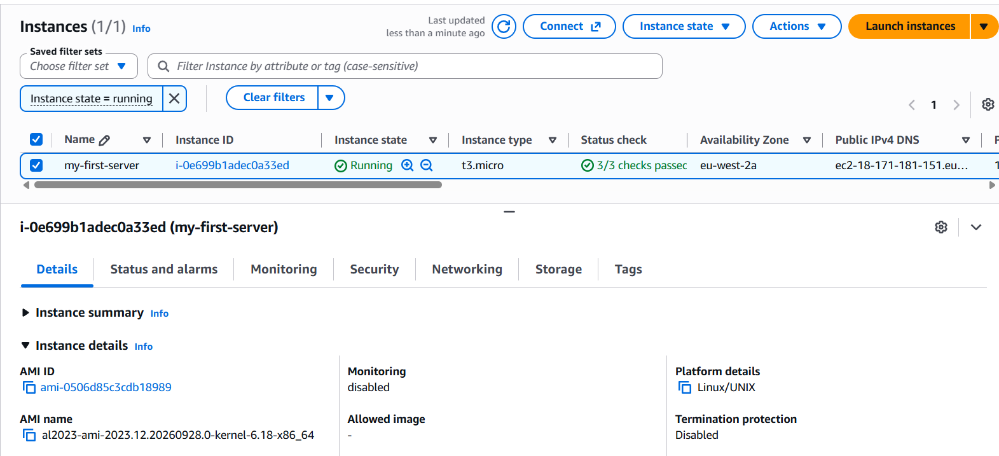
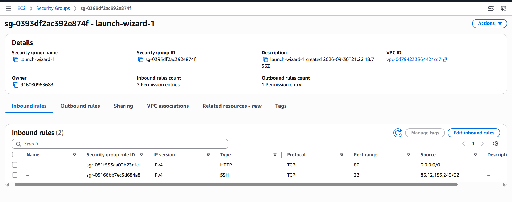
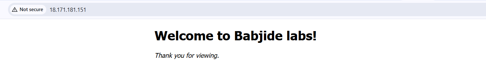

# Lab 01 – Deploy an Nginx Web Server on AWS EC2

## Objective
Launch an Amazon Linux 2023 EC2 instance, connect over SSH, install and enable Nginx, customise the default page, and confirm it is reachable from the public internet.

## Environment
| Item | Value |
|---|---|
| Cloud | AWS (region `eu-west-2`, AZ `eu-west-2a`) |
| Instance name / type | `my-first-server` / `t3.micro` |
| OS | Amazon Linux 2023 |
| Web server | Nginx 1.30.5 |
| Client | Ubuntu 26.04 LTS on WSL2 |
| Access | SSH with a key pair (`ec2-user`) |

## Steps

### 1. Launch the instance
Launched `my-first-server` (t3.micro). Status checks showed **3/3 passed** and the state was **Running**.



### 2. Configure the security group
The `launch-wizard-1` security group allows:

| Type | Protocol | Port | Source | Purpose |
|---|---|---|---|---|
| HTTP | TCP | 80 | `0.0.0.0/0` | Public web access |
| SSH | TCP | 22 | my IP `/32` | Admin access from my machine only |



### 3. Connect via SSH
```bash
ssh -i key.pem ec2-user@<PUBLIC_IP>
```
Accepted the host fingerprint on first connection.

### 4. Install and start Nginx
`apt` is not available on Amazon Linux, which uses `dnf`/`yum`.
```bash
sudo yum update
sudo yum install nginx -y
sudo systemctl start nginx
sudo systemctl enable nginx   # start automatically on boot
```

### 5. Verify locally
```bash
curl localhost        # returns the default "Welcome to nginx!" page
ip a                  # private IP 172.31.6.223 on ens5
curl ifconfig.me      # public IP as seen from the internet
```

### 6. Customise the page
```bash
sudo nano /usr/share/nginx/html/index.html
```
Replaced the heading and message:
```html
<h1>Welcome to Babjide labs!</h1>
<p><em>Thank you for viewing.</em></p>
```

### 7. Verify from the browser
Visiting `http://<PUBLIC_IP>` shows the custom page.



## Key learnings
- Amazon Linux uses `yum`/`dnf`, not `apt` (that is Debian/Ubuntu).
- A security group is a virtual firewall: port 80 must be open for the site to be reachable, and port 22 should be limited to my own IP.
- `systemctl start` runs a service now; `systemctl enable` makes it survive reboots.
- Nginx serves static files from `/usr/share/nginx/html` by default.
- The private IP (`ip a`) differs from the public IP (`curl ifconfig.me`).

## Troubleshooting notes
- `sudo: apt: command not found` – wrong package manager for the distro; used `yum`.

## Clean up
Stop or terminate the instance when finished to avoid charges.
