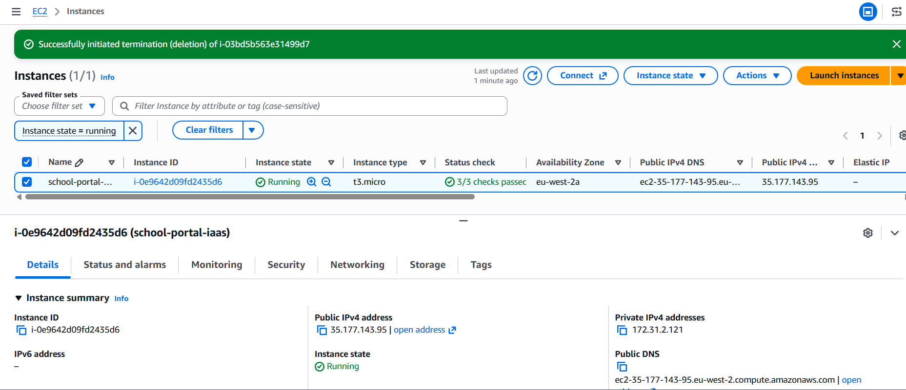
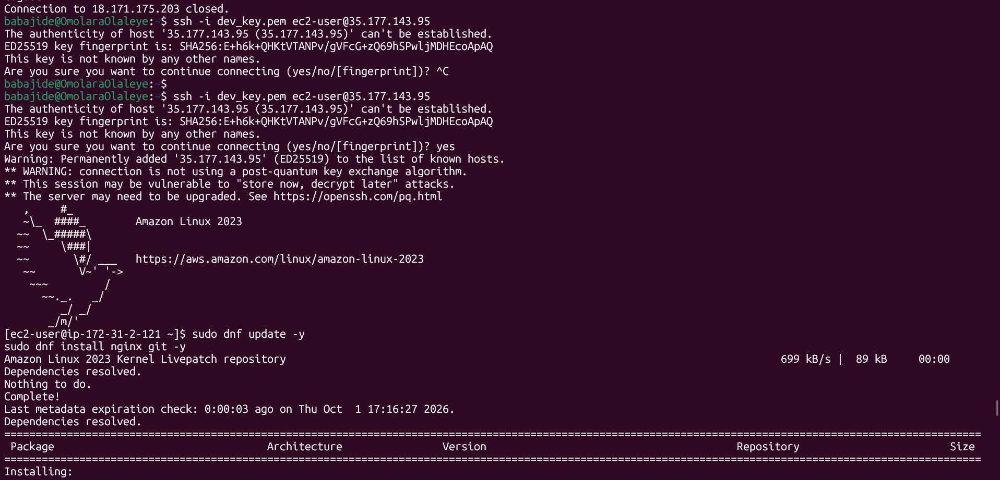
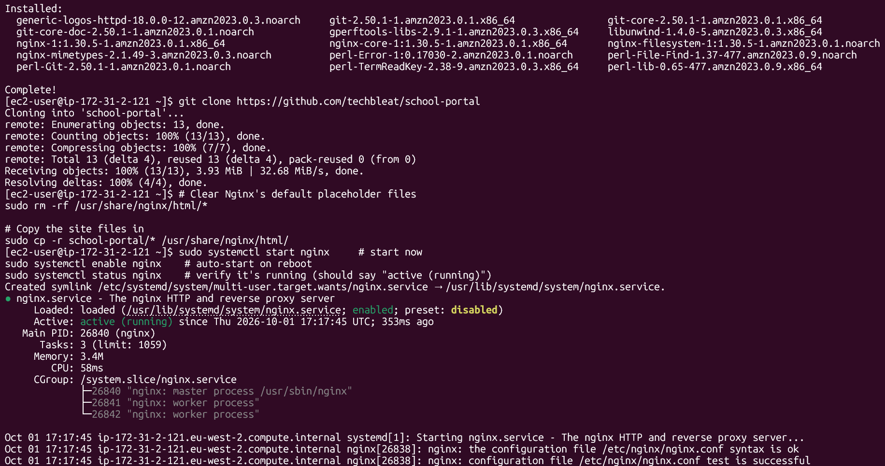
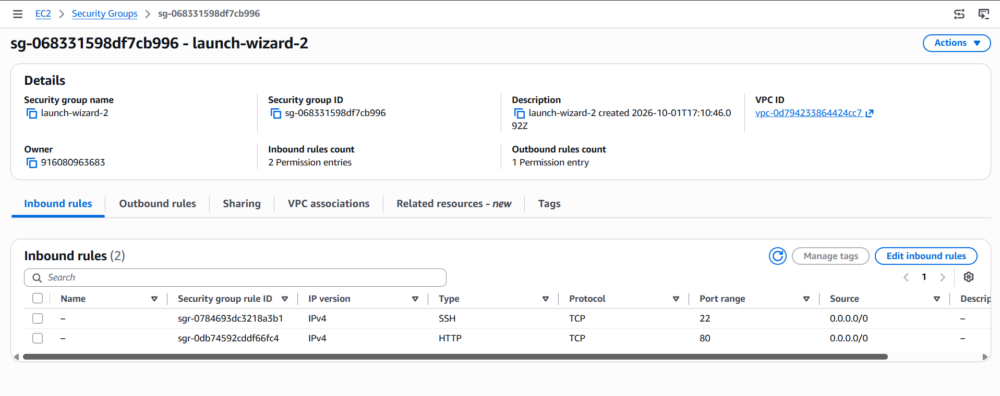
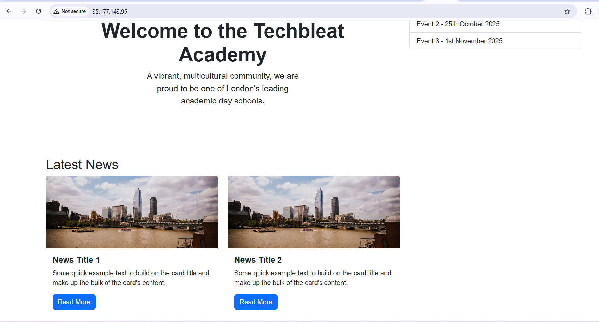

# Cloud Service Models – Part A: IaaS Deployment (EC2)

## Objective
Deploy the TechBleat `school-portal` website on a virtual server that I manage myself (IaaS) using AWS EC2, Nginx and Git.

## What is IaaS?
Infrastructure as a Service gives me a virtual server and its network. AWS looks after the physical hardware and the virtualisation layer. I am responsible for the operating system, installed software, security patches, web server configuration and the application files.

## Environment
| Item | Value |
|---|---|
| Cloud | AWS EC2, region `eu-west-2` |
| Instance name / type | `school-portal-iaas` / `t3.micro` |
| OS | Amazon Linux 2023 |
| Web server | Nginx 1.30.5 |
| Git | 2.50.1 |
| Source code | https://github.com/techbleat/school-portal |
| Access | SSH with a key pair (`ec2-user`) |

## Steps

### 1. Create the EC2 instance
Launched `school-portal-iaas` on Amazon Linux 2023. Status checks showed **3/3 passed** and the state was **Running**.



### 2. Connect via SSH
```bash
ssh -i dev_key.pem ec2-user@<PUBLIC_IP>
```
Accepted the host fingerprint (`yes`) on the first connection.

### 3. Install Nginx and Git
```bash
sudo dnf update -y
sudo dnf install nginx git -y
```



### 4. Clone the repository
```bash
git clone https://github.com/techbleat/school-portal
```

### 5. Copy the website files to the Nginx web root
Cleared Nginx's default placeholder files first, then copied the site in:
```bash
sudo rm -rf /usr/share/nginx/html/*
sudo cp -r school-portal/* /usr/share/nginx/html/
```

### 6. Start Nginx
```bash
sudo systemctl start nginx
sudo systemctl enable nginx   # start automatically on boot
sudo systemctl status nginx   # shows "active (running)"
```



### 7. Open port 80
Added an inbound rule to the instance's security group: **HTTP, TCP, port 80, source `0.0.0.0/0`**.



### 8. Access via browser
Opened `http://<PUBLIC_IP>` and the Techbleat Academy school portal loaded.



## Key learnings
- With IaaS I manage the OS, software installs and web server myself.
- Nginx serves static files from `/usr/share/nginx/html`, so the default placeholder page has to be cleared or replaced.
- The security group acts as a firewall: the site is unreachable from the internet until port 80 is open.
- `systemctl enable` keeps Nginx running after a reboot.

## Notes
- The task specified `t2.micro`; I used `t3.micro`.

## Clean up
Terminate the instance after the task to avoid charges.

## Part B: PaaS
_Coming next: deploying the same website on a PaaS platform._
